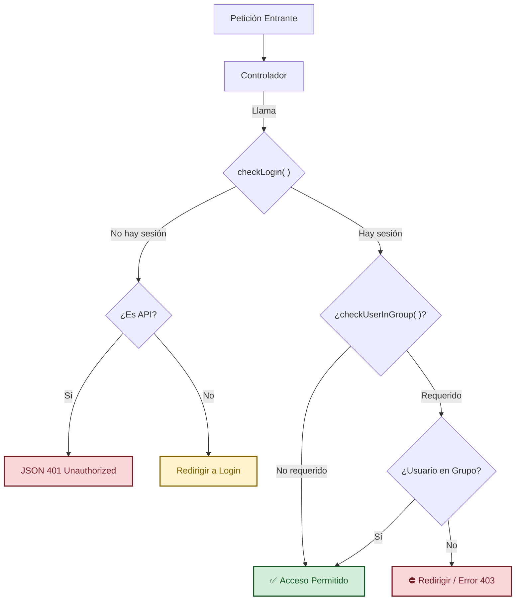

# Sistema de Autenticación y Permisos en Ragnos

Ragnos incorpora un sistema de autenticación ligero y flexible integrado directamente en el núcleo del framework. Este sistema gestiona sesiones de usuario, protección de controladores y control de acceso basado en roles (grupos).

El sistema se apoya principalmente en el servicio `App\Services\Admin_aut` y en la clase `BaseController`.

## Tablas de Base de Datos

El sistema espera una estructura de base de datos específica:

- **`gen_usuarios`**: Tabla de usuarios (`usu_id`, `usu_nombre`, `usu_login`, `usu_pword`, `usu_activo`, `usu_grupo`).
- **`gen_gruposdeusuarios`**: Tabla de roles (`gru_id`, `gru_nombre`).

## Protección de Controladores

Todos los controladores que extienden de `BaseController` (incluyendo [`RDatasetController`](../datasets/datasets.md), [`RProcessController`](server_side_events.md), etc.) tienen acceso a métodos de protección simplificados.

### Flujo de Verificación



### `checkLogin()`

Este método verifica si el usuario tiene una sesión activa. Si no la tiene:

1.  Para peticiones Web: Redirige al login (`admin/login`).
2.  Para API: Verifica el header `Authorization` contra el `usu_token` en base de datos. Si falla, devuelve un error 401 JSON.

**Uso:**
Se recomienda llamarlo al inicio de cualquier función que requiera autenticación, o en el constructor si todo el controlador es privado.

!!! tip "Controllers Públicos"

    Si tienes un controlador público (ej. página de inicio), simplemente no llames a `checkLogin()`.

```php
public function miFunciopPrivada()
{
    $this->checkLogin();

    // El resto del código solo se ejecuta si el usuario está logueado
    return view('mi_vista');
}
```

### `checkUserInGroup($grupos)`

Restringe el acceso exclusivamente a usuarios que pertenezcan a los grupos especificados.

- **Parámetro**: Puede ser un `string` con el nombre de un grupo o un `array` de strings para permitir múltiples grupos.
- **Comportamiento**:
  - Si no cumple la condición, redirige a `admin/index` (o devuelve 403/401 si es API).
  - Internamente llama a `checkLogin()`, por lo que no es necesario llamar a ambos.

**Uso:**

```php
public function __construct()
{
    // Solo permitir acceso a Administradores
    $this->checkUserInGroup('Administrador');
}

public function reporteGerencial()
{
    // Permitir acceso a Administradores o Gerentes
    $this->checkUserInGroup(['Administrador', 'Gerencia']);

    // Lógica del reporte...
}
```

---

## Servicio `Admin_aut`

Para lógica más granular dentro de tus vistas o controladores, puedes acceder directamente al servicio de autenticación.

Lo ideal es invocarlo mediante `service('Admin_aut')`.

### Funciones Principales

#### `isLoggedIn()`

Devuelve `true` si hay un usuario logueado, `false` en caso contrario.

```php
if (service('Admin_aut')->isLoggedIn()) {
    echo "Usuario conectado";
}
```

#### `id()`

Devuelve el ID (`usu_id`) del usuario actual.

#### `name()`

Devuelve el nombre completo (`usu_nombre`) del usuario actual.

#### `isUserInGroup($grupo)`

Evalúa si el usuario actual pertenece al grupo indicado. Es muy útil para ocultar o mostrar botones en las vistas o aplicar lógica condicional. Comparación _case-insensitive_.

```php
// En un controlador o vista
if (service('Admin_aut')->isUserInGroup('Ventas')) {
    // Mostrar botón de crear pedido
}
```

#### `campo($nombreCampo)`

Obtiene cualquier campo de la tabla `gen_usuarios` para el usuario actual. La información se carga bajo demanda (lazy loading) la primera vez que se solicita un campo.

```php
// Obtener el email o cualquier campo personalizado
$email = service('Admin_aut')->getField('usu_email');
```

---

## Autenticación vía API

El sistema soporta autenticación para APIs REST de forma transparente.

1.  Al hacer login, se genera un token seguro en `usu_token`.
2.  El cliente debe enviar este token en el header `Authorization`.
3.  `checkLogin()` detecta automáticamente si la petición es una llamada API (`isApiCall()`) y valida el token en lugar de la sesión de PHP.

Esto permite utilizar los mismos controladores para la interfaz web y para aplicaciones móviles o frontends desacoplados.

## Ejemplo Completo

```php
<?php

namespace App\Controllers;

use App\ThirdParty\Ragnos\Controllers\BaseController;

class Pedidos extends BaseController
{
    public function __construct()
    {
        // Cargar helpers necesarios
        helper(['form', 'url']);
    }

    public function index()
    {
        // 1. Asegurar que esté logueado
        $this->checkLogin();

        $auth = service('Admin_aut');

        // 2. Obtener datos del usuario
        $data['usuario'] = $auth->name();
        $data['esAdmin'] = $auth->isUserInGroup('Administrador');

        return view('pedidos/index', $data);
    }

    public function eliminar($id)
    {
        // 3. Restricción estricta: Solo Admins pueden eliminar
        $this->checkUserInGroup('Administrador');

        $model = new \App\Models\PedidosModel();
        $model->delete($id);

        return redirect()->to('/pedidos');
    }
}
```
