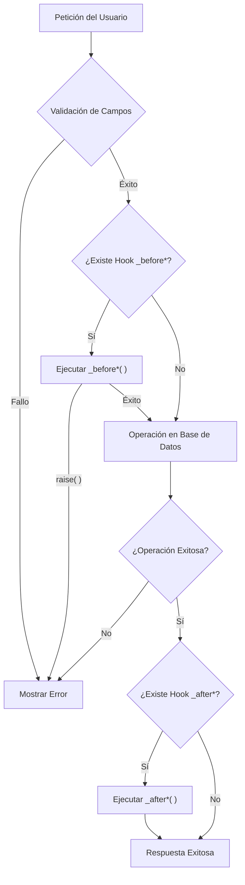

# Hooks y ciclo de vida en Ragnos

En Ragnos, los **hooks** permiten ejecutar lógica personalizada en distintos momentos del ciclo de vida de un dataset.  
Son el mecanismo principal para **extender comportamiento** sin romper el modelo declarativo.

Los hooks se definen como métodos protegidos dentro del controlador que extiende `RDatasetController`.

!!! info "Concepto Clave"

    El controlador **no implementa el CRUD** directamente manualmente. Ragnos se encarga de la operación de base de datos, y tú solo "te enganchas" (hook) en los puntos clave para inyectar tu lógica de negocio.

---

## Ciclo de Vida Visual

Entender el flujo de ejecución es crucial para saber dónde colocar tu lógica.



---

## Hooks disponibles

Ragnos expone los siguientes hooks:

| Hook              | Momento de ejecución              |
| ----------------- | --------------------------------- |
| `_beforeInsert()` | Antes de insertar un registro     |
| `_afterInsert()`  | Después de insertar un registro   |
| `_beforeUpdate()` | Antes de actualizar un registro   |
| `_afterUpdate()`  | Después de actualizar un registro |
| `_beforeDelete()` | Antes de eliminar un registro     |
| `_afterDelete()`  | Después de eliminar un registro   |

Todos los hooks son **opcionales**.

---

## Estructura básica de un hook

Algunos hooks reciben parámetros por referencia para permitir la manipulación de datos, mientras que otros no reciben argumentos.

```php
// Hook con manipulación de datos (por referencia)
protected function _beforeInsert(&$data)
{
    $data['campo'] = 'valor';
}

// Hook de evento simple
protected function _afterUpdate()
{
    // Lógica posterior
}
```

## Hook `_beforeInsert(&$data)`

Se ejecuta **antes de un INSERT**. Recibe por referencia el array `$data` con los valores que se van a insertar.

!!! warning "Atención"

    Cualquier modificación hecha a `$data` **se reflejará directamente en la base de datos**.

### Usos comunes

- Inicializar valores automáticos
- Normalizar o sanitizar datos
- Validaciones adicionales sobre el _payload_
- Generar códigos o UUIDs

### Ejemplo Práctico

```php
protected function _beforeInsert(&$data)
{
    // Asignar fecha de creación manual
    $data['created_at'] = date('Y-m-d H:i:s');

    // Forzar mayúsculas en el RFC
    if (isset($data['rfc'])) {
        $data['rfc'] = strtoupper($data['rfc']);
    }
}
```

---

## Hook `_afterInsert()`

Se ejecuta **después de un INSERT exitoso**.

### Usos comunes

- Logs
- Cache
- Notificaciones

### Ejemplo

```php
protected function _afterInsert()
{
    log_message('info', 'Registro creado');
}
```

---

## Hook `_beforeUpdate(&$data)`

Se ejecuta **antes de un UPDATE**. Recibe por referencia el array `$data` que contiene **solo los campos que se van a actualizar**.

**Nota:** Es posible agregar campos adicionales a `$data` para forzar su actualización.

### Usos comunes

- Validaciones condicionales sobre datos entrantes
- Actualizar campos de control (ej. `updated_at`, `modified_by`)
- Prevenir modificaciones de ciertos campos

### Ejemplo

```php
protected function _beforeUpdate(&$data)
{
    // Registrar quién modificó el registro
    $data['updated_by'] = session('user_id');

    // Validación usando oldValue() junto con datos entrantes
    if ($this->oldValue('status') === 'cerrado') {
         // Si intentan cambiar algo en un registro cerrado
         raise
    }
}
```

- Control de cambios críticos

### Ejemplo

```php
protected function _beforeUpdate()
{
    if ($this->data['status'] === 'cerrado') {
        throw new \Exception('No se puede modificar un registro cerrado');
    }
}
```

---

## Hook `_afterUpdate()`

Se ejecuta **después de un UPDATE exitoso**.

### Usos comunes

- Invalidar cache
- Recalcular datos dependientes
- Auditoría

### Ejemplo real

```php
protected function _afterUpdate()
{
    if (fieldHasChanged('creditLimit')) {
        \Config\Services::cache()->delete('estadosdecuenta');
    }
}
```

---

## Hook `_beforeDelete()`

Se ejecuta **antes de un DELETE**.

### Usos comunes

- Validar dependencias
- Evitar borrados críticos

### Ejemplo

```php
protected function _beforeDelete()
{
    if ($this->hasRelations()) {
        throw new \Exception('No se puede eliminar el registro');
    }
}
```

---

## Hook `_afterDelete()`

Se ejecuta **después de un DELETE**.

### Usos comunes

- Limpieza de recursos
- Cache
- Logs

### Ejemplo

```php
protected function _afterDelete()
{
    log_message('info', 'Registro eliminado');
}
```

---

## Acceso a valores: `newValue()` y `oldValue()`

Para facilitar el acceso a los datos dentro de los hooks, Ragnos proporciona dos funciones helper esenciales:

- **`newValue('campo')`**: Obtiene el valor que se está intentando guardar (presente en la petición).
- **`oldValue('campo')`**: Obtiene el valor original que ya existe en la base de datos (antes de la modificación).

### Disponibilidad según la operación

No todas las funciones tienen sentido en todas las operaciones:

| Helper       | Insert | Update | Delete |
| :----------- | :----: | :----: | :----: |
| `newValue()` |   ✅   |   ✅   |   ❌   |
| `oldValue()` |   ❌   |   ✅   |   ✅   |

!!! note "Limitaciones lógicas"

    **Insert**: No existe un valor anterior (`oldValue` devuelve null/vacío).
    **Delete**: No se envía un valor nuevo (`newValue` no aplica), solo se elimina lo existente.

### Ejemplos de uso

**Validar cambio de estado (Update):**

```php
protected function _beforeUpdate()
{
    // Evitar que una tarea "Completada" vuelva a "Pendiente"
    if (oldValue('status') === 'completed' && newValue('status') === 'pending') {
        raise('No se puede reabrir una tarea completada.');
    }
}
```

**Validar condición de borrado (Delete):**

```php
protected function _beforeDelete()
{
    // Solo permitir borrar si el estado es 'borrador' (verificado en el valor actual/viejo)
    if (oldValue('status') !== 'draft') {
        raise('Solo se pueden eliminar borradores.');
    }
}
```

---

## Detección de cambios: `fieldHasChanged()`

Ragnos permite saber si un campo fue modificado durante un UPDATE.

### Uso

```php
if (fieldHasChanged('creditLimit')) {
    // acción específica
}
```

### Características

- Compara valor anterior vs nuevo
- Solo disponible en hooks de update
- Ideal para lógica condicional

---

## Acceso a servicios de CodeIgniter

Desde un hook puedes acceder a servicios:

```php
$cache = \Config\Services::cache();
$logger = \Config\Services::logger();
```

Esto permite integrar:

- Cache
- Logs
- Email
- APIs externas

---

## Interrupción segura: `raise()`

En ocasiones es necesario detener una operación CRUD debido a reglas de negocio específicas que van más allá de la validación de campos estándar. Para esto, Ragnos proporciona la función auxiliar `raise()`.

### ¿Qué hace `raise()`?

1. Interrumpe inmediatamente la ejecución del script.
2. Evita que la operación (INSERT, UPDATE, DELETE) se complete.
3. Muestra el mensaje de error al usuario en la interfaz gráfica.

### Ejemplos reales

**1. Proteger registros del sistema (evitar borrado)**

En este ejemplo, evitamos que se elimine el grupo de usuarios con ID 1 (Administradores):

```php
public function _beforeDelete()
{
    // Obtener el ID del registro que se está intentando borrar
    $id = oldValue('gru_id');

    if ($id == 1) {
        raise('No se puede borrar el grupo de administradores');
    }
}
```

**2. Validar integridad referencial manual**

A veces es preferible validar relaciones manualmente antes de dejar que la base de datos arroje un error SQL.

```php
private function checkAssociatedUsers($groupId)
{
    $db = db_connect();
    // Verificar si existen usuarios para este grupo
    $userCount = $db->table('gen_usuarios')->where('usu_grupo', $groupId)->countAllResults();

    if ($userCount > 0) {
        // Detiene el proceso y avisa al usuario
        raise('No se puede borrar porque tiene usuarios asociados');
    }
}
```

**3. Proteger registros contra edición**

Similar al borrado, podemos impedir modificaciones en registros críticos dentro del hook `_beforeUpdate`:

```php
public function _beforeUpdate(&$a)
{
    if (oldValue('gru_id') == 1) {
        raise('No se puede modificar el grupo de administradores');
    }
}
```

!!! tip "Nota de Diseño"
`raise()` es la forma recomendada de lanzar errores de validación lógica ("Soft errors") que el usuario debe corregir o conocer, a diferencia de `throw new Exception` que podría interpretarse como un error del sistema ("Hard error").

---

## Caso de Estudio: Cifrado de Contraseñas (Usuarios)

Uno de los usos más habituales de los hooks es el tratamiento de datos sensibles como las contraseñas.
A continuación se muestra cómo el catálogo de **Usuarios** gestiona el cifrado de claves utilizando `_beforeInsert` y `_beforeUpdate`.

### Código del controlador

```php
public function _beforeInsert(&$userData)
{
    // Al crear, SIEMPRE se cifra la contraseña
    $userData['usu_pword'] = md5(strtoupper($userData['usu_pword']));
}

public function _beforeUpdate(&$userData)
{
    // Al editar, SOLO se cifra si el usuario escribió una nueva contraseña
    if (fieldHasChanged('usu_pword')) {
        $userData['usu_pword'] = md5(strtoupper($userData['usu_pword']));
    }
}
```

### Explicación detallada

1.  **Inserción (`_beforeInsert`)**:
    Cuando se crea un usuario nuevo, la contraseña viene en texto plano desde el formulario. Es obligatorio cifrarla antes de guardarla para cumplir con las políticas de seguridad. Aquí no hay condicionales: se cifra siempre.

2.  **Actualización (`_beforeUpdate`)**:
    Aquí la lógica es más sutil.
    - Si el administrador edita un usuario para cambiarle solo el nombre o el grupo, el campo de contraseña en el formulario puede venir vacío o relleno con el hash actual (dependiendo de la implementación del frontend).
    - Si volviéramos a aplicar `md5()` sobre una contraseña que ya es un hash (o que no ha cambiado), **corromperíamos la contraseña**, haciendo imposible que el usuario inicie sesión.
    - **Solución:** Usamos `fieldHasChanged('usu_pword')`. Esta función compara el valor enviado en el formulario (`newValue`) con el valor existente en la base de datos (`oldValue`).
      - Si son diferentes: Significa que el usuario escribió una nueva contraseña. **Procedemos a cifrarla.**
      - Si son iguales: No hacemos nada, manteniendo el hash original intacto.

Este patrón garantiza que las contraseñas solo se modifiquen cuando es intencional.

---

## Hooks de Interfaz (UI)

Además de los hooks de ciclo de vida de datos, existen hooks para intervenir en la generación de la interfaz de usuario.

### `_customFormDataFooter()`

Este método permite insertar HTML o JavaScript adicional al pie del formulario de edición del dataset.

- **Propósito:** Agregar paneles de detalle, resúmenes, botones personalizados o scripts específicos para ese módulo.
- **Implementación:** El método debe retornar un `string` (HTML). Lo ideal es retornar una vista.

**Ejemplo:**

```php
function _customFormDataFooter()
{
    // Obtener ID actual del formulario (si es edición)
    $id = $this->request->getPost($this->getIdField());

    // Pasar datos a una vista parcial
    return view('Tienda/detalle_pedidos', [
        'orderId' => $id,
        'permisos' => $this->hasPermission('admin')
    ]);
}
```

El contenido retornado se renderizará inmediatamente después de los campos del formulario y antes de los botones de acción.

---

## Buenas prácticas

!!! success "Recomendado"

    **Mantén los hooks pequeños:** La lógica compleja debe ir a Servicios o Librerías. - **Documenta efectos secundarios:** Si un hook altera otra tabla, deja un comentario claro. - **Usa `_afterUpdate` para cache:** Es el lugar más seguro para invalidar caches.

!!! fail "A evitar"

    **No reemplaces el controlador:** Los hooks son para _extender_, no para reescribir la lógica base. - **Evita dependencias de orden:** No asumas que un campo se actualiza antes que otro dentro del mismo array. - **Cuidado con el SQL manual:** Intenta usar los modelos siempre que sea posible.

---

## Filosofía

Los hooks en Ragnos permiten **extender sin romper**:

- **Desacoplamiento:** No acoplan lógica de negocio dura al mecanismo CRUD genérico.
- **Declarativo:** Mantienen el enfoque de configuración sobre programación.
- **Mantenibilidad:** Separan claramente la responsabilidad "Qué guardar" de "Qué hacer cuando se guarda".

!!! quote "Filosofía Ragnos"

    **En Ragnos, los hooks no controlan el flujo: reaccionan al dominio.**

!!! quote "Filosofía Ragnos"

    **Declarativo:** Mantienen el enfoque de configuración sobre programación.
    **Mantenibilidad:** Separan claramente la responsabilidad "Qué guardar" de "Qué hacer cuando se guarda".
