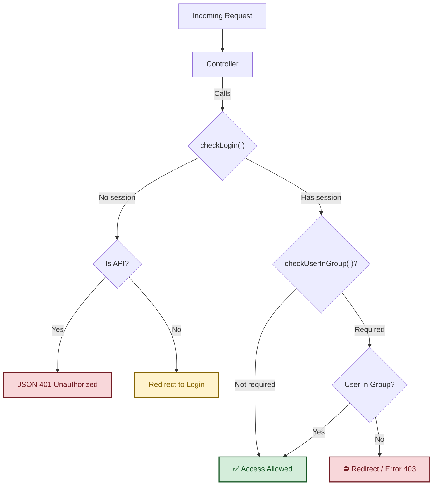

# Integrated Authentication and Permissions System

Ragnos includes a lightweight flexible authentication system integrated directly into framework core. Handles user sessions, controller protection and Role Based Access Control (RBAC).

System relies mainly on `App\Services\Admin_aut` service and `BaseController` class.

## Database Tables

System expects specific database structure:

- **`gen_usuarios`**: Users table (`usu_id`, `usu_nombre`, `usu_login`, `usu_pword`, `usu_activo`, `usu_grupo`).
- **`gen_gruposdeusuarios`**: Roles table (`gru_id`, `gru_nombre`).

## Controller Protection

All controllers extending `BaseController` (including [`RDatasetController`](../datasets/datasets.md), [`RProcessController`](server_side_events.md), etc.) access simplified protection methods.

### Verification Flow



### `checkLogin()`

Verifies if user has active session. If not:

1.  Web requests: Redirects to login (`admin/login`).
2.  API requests: Verifies `Authorization` header against `usu_token` in DB. If fails, returns JSON 401 error.

**Usage:**
Recommended to call at start of function requiring auth, or in constructor if whole controller private.

!!! tip "Public Controllers"

    If you have a public controller (e.g. Home page), simply do not call `checkLogin()`.

```php
public function myPrivateFunction()
{
    $this->checkLogin();

    // Rest of code only executes if user logged in
    return view('my_view');
}
```

### `checkUserInGroup($groups)`

Restricts access exclusively to users belonging to specified groups.

- **Parameter**: Can be `string` with group name or `array` of strings for multiple groups.
- **Behavior**:
  - If condition not met, redirects to `admin/index` (or returns 403/401 if API).
  - Internally calls `checkLogin()`, so calling both is unnecessary.

**Usage:**

```php
public function __construct()
{
    // Only allow Administrator access
    $this->checkUserInGroup('Administrator');
}

public function managementReport()
{
    // Allow Admins or Management
    $this->checkUserInGroup(['Administrator', 'Management']);

    // Report logic...
}
```

---

## `Admin_aut` Service

For granular logic inside views/controllers, access auth service directly.

Ideally invoke via `service('Admin_aut')`.

### Main Functions

#### `isLoggedIn()`

Returns `true` if user logged in, `false` otherwise.

```php
if (service('Admin_aut')->isLoggedIn()) {
    echo "User connected";
}
```

#### `id()`

Returns current user ID (`usu_id`).

#### `name()`

Returns current user full name (`usu_nombre`).

#### `isUserInGroup($group)`

Evaluates if current user belongs to indicated group. Useful for hiding/showing buttons in views or conditional logic. Case-insensitive.

```php
// In controller or view
if (service('Admin_aut')->isUserInGroup('Sales')) {
    // Show create order button
}
```

#### `getField($fieldName)`

Gets any field from `gen_usuarios` table for current user. Info lazily loaded on first request.

```php
// Get email or custom field
$email = service('Admin_aut')->getField('usu_email');
```

---

## API Authentication

System supports authentication for REST APIs transparently.

1.  On login, secure token generated in `usu_token`.
2.  Client must send token in `Authorization` header.
3.  `checkLogin()` automatically detects API call (`isApiCall()`) and validates token instead of PHP session.

Allows using same controllers for web interface and mobile apps or decoupled frontends.

## Complete Example

```php
<?php

namespace App\Controllers;

use App\ThirdParty\Ragnos\Controllers\BaseController;

class Orders extends BaseController
{
    public function __construct()
    {
        // Load helpers
        helper(['form', 'url']);
    }

    public function index()
    {
        // 1. Ensure logged in
        $this->checkLogin();

        $auth = service('Admin_aut');

        // 2. Get user data
        $data['user'] = $auth->name();
        $data['isAdmin'] = $auth->isUserInGroup('Administrator');

        return view('orders/index', $data);
    }

    public function delete($id)
    {
        // 3. Strict restriction: Only Admins can delete
        $this->checkUserInGroup('Administrator');

        $model = new \App\Models\OrdersModel();
        $model->delete($id);

        return redirect()->to('/orders');
    }
}
```
