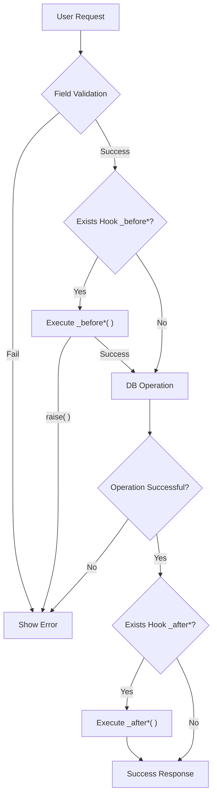

# Hooks and Lifecycle in Ragnos

In Ragnos, **hooks** allow executing custom logic at different moments of dataset lifecycle.
Are main mechanism to **extend behavior** without breaking declarative model.

Hooks defined as protected methods inside controller extending `RDatasetController`.

!!! info "Key Concept"

    Controller **does not implement CRUD** manually. Ragnos handles database operation, you just "hook" into key points to inject business logic.

---

## Visual Lifecycle

Understanding flow is crucial to know where to place logic.



---

## Available Hooks

Ragnos exposes following hooks, all optional:

| Hook              | Execution Moment        |
| ----------------- | ----------------------- |
| `_beforeInsert()` | Before inserting record |
| `_afterInsert()`  | After inserting record  |
| `_beforeUpdate()` | Before updating record  |
| `_afterUpdate()`  | After updating record   |
| `_beforeDelete()` | Before deleting record  |
| `_afterDelete()`  | After deleting record   |

---

## Fundamental Tools and Concepts

Before writing specific functions, important to know tools Ragnos provides inside hooks to interact with data and app flow.

### 1. Basic Structure

Hooks of type `_before*` (Insert and Update) receive `$data` array by reference, allowing value modification before reaching DB. If modification not needed, argument can be omitted.

```php
// Hook with data manipulation (by reference)
protected function _beforeInsert(&$data)
{
    $data['created_at'] = date('Y-m-d');
}
```

### 2. Value Access: `newValue()` and `oldValue()`

To facilitate business logic, Ragnos provides helper functions to inspect data state:

- **`newValue('field')`**: Value trying to be saved (request payload).
- **`oldValue('field')`**: Original value existing in database (before modification).

| Helper       | Insert | Update | Delete |
| :----------- | :----: | :----: | :----: |
| `newValue()` |   ✅   |   ✅   |   ❌   |
| `oldValue()` |   ❌   |   ✅   |   ✅   |

### 3. Change Detection: `fieldHasChanged()`

Especially useful in updates to execute actions only if specific field modified.

```php
if (fieldHasChanged('status')) {
    // Send status change notification
}
```

### 4. Safe Interruption: `raise()`

If need to stop operation due to business rule, use `raise()`. Stops process and shows error message to user, preventing CRUD operation.

```php
if (oldValue('locked') === true) {
    raise('Cannot modify locked record.');
}
```

!!! tip "Design Note"

    `raise()` preferable to `throw new Exception` for logic validation errors ("Soft errors") that user must correct.

!!! note "Refactoring and Organization"

    Although Ragnos **does not force** you to create external classes for hook functions (you can write logic directly in the controller), if **business rules are sufficiently complex**, it is convenient and recommended to refactor them into dedicated **Models**, **Libraries**, or **Services**. This helps keep code organized, reusable, and easier to maintain.

---

## Insertion Hooks

Executed during creation of new records.

### `_beforeInsert(&$data)`

Executed **before** INSERT. Receives `$data` by reference.

**Common uses:**

- Initialize automatic values (dates, UUIDs).
- Normalize data (uppercase, formats).
- Custom payload validations.

```php
protected function _beforeInsert(&$data)
{
    // Assign manual creation date
    $data['created_at'] = date('Y-m-d H:i:s');

    // Force uppercase in RFC
    if (isset($data['rfc'])) {
        $data['rfc'] = strtoupper($data['rfc']);
    }
}
```

### `_afterInsert()`

Executed **after** successful INSERT.

**Common uses:**

- Audit logs.
- Welcome notifications sending.

```php
protected function _afterInsert()
{
    log_message('info', 'New user registered with ID ' . $this->insertID());
}
```

---

## Update Hooks

Manage modification of existing records. Where most complex business logic resides.

### `_beforeUpdate(&$data)`

Executed **before** UPDATE. Receives `$data` with fields to update.

**Common uses:**

- State transition validations.
- Register edit metadata (`updated_by`).
- Critical field protection.

```php
protected function _beforeUpdate(&$data)
{
    // Register who modified
    $data['updated_by'] = session('user_id');

    // Validate business rule: Cannot reopen completed tasks
    if (oldValue('status') === 'completed' && newValue('status') === 'pending') {
        raise('Cannot reopen completed task.');
    }
}
```

### `_afterUpdate()`

Executed **after** successful UPDATE.

**Common uses:**

- Invalidate cache.
- Recalculate dependent data in other tables.

```php
protected function _afterUpdate()
{
    // If credit limit changed, invalidate statement cache
    if (fieldHasChanged('creditLimit')) {
        \Config\Services::cache()->delete('accountstatements');
    }
}
```

---

## Deletion Hooks

Manage information deletion.

### `_beforeDelete()`

Executed **before** DELETE.

**Common uses:**

- Validate dependencies (manual referential integrity).
- Prevent system record deletion.

```php
protected function _beforeDelete()
{
    // Protect Administrator user (ID 1)
    if (oldValue('user_id') == 1) {
        raise('Cannot delete main admin user.');
    }

    // Verify relations manually
    if ($this->hasRelations()) {
        raise('Cannot delete record because has associated data.');
    }
}
```

### `_afterDelete()`

Executed **after** DELETE.

**Common uses:**

- Cleanup attachments (images, docs).
- Activity logs.

```php
protected function _afterDelete()
{
    log_message('info', 'Record deleted successfully.');
}
```

---

## Case Study: Password Hashing

Real example combining hooks to manage user passwords securely.

```php
// On create, ALWAYS hash password
public function _beforeInsert(&$userData)
{
    $userData['usu_pword'] = md5(strtoupper($userData['usu_pword']));
}

// On edit, ONLY hash if user wrote new password
public function _beforeUpdate(&$userData)
{
    if (fieldHasChanged('usu_pword')) {
        $userData['usu_pword'] = md5(strtoupper($userData['usu_pword']));
    }
}
```

**Explanation:**

1. In `_beforeInsert`, password always comes plaintext, so hash unconditionally.
2. In `_beforeUpdate`, use `fieldHasChanged` to detect if user entered new key. If check skipped, existing hash re-hashed, corrupting password.

---

## UI Hooks

Ragnos allows intervention in generated visual interface too.

### `_customFormDataFooter()`

Inserts HTML or scripts at footer of edit form.

```php
function _customFormDataFooter()
{
    $id = $this->request->getPost($this->getIdField());

    // Return partial view
    return view('Store/order_detail', ['orderId' => $id]);
}
```

---

## Best Practices

!!! success "Recommended"

    **Keep hooks small:** Complex logic goes to Services or Libraries.

    **Document side effects:** If hook alters other table, leave clear comment. - **Usa `raise()`** for validation errors instead of hard exceptions.

!!! fail "To Avoid"

    **Do not replace controller:** Hooks are to _extend_, not rewrite CRUD flow.

    **Careful with manual SQL:** Try to use models whenever possible.

---

## Philosophy

Hooks in Ragnos allow **extending without breaking**:

- **Decoupling:** Do not couple hard business logic to generic CRUD mechanism.
- **Declarative:** Keep config over programming approach.
- **Maintainability:** Clearly separate "What to save" from "What to do when saving".

!!! quote "Ragnos Philosophy"

    **In Ragnos, hooks don't control flow: they react to domain.**
