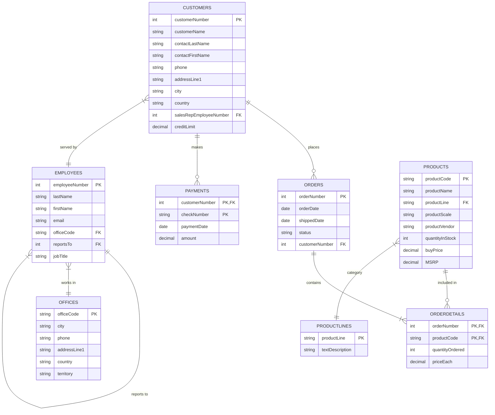

# Demo Database (Classicmodels)

Ragnos includes the **Classicmodels** sample database, a well-known standard implementation in the development world for testing relational database functionalities.

This database models a **retailer of scale models of classic cars**. It contains typical business information: customers, products, orders, payments, employees, and offices.

## 📊 Database Structure

The database consists of 8 related tables. Below is an Entity-Relationship (ER) diagram illustrating the structure:

## 📝 Table Descriptions

Below is the purpose of each table:

### 1. Customers

Stores information about the company's customers.

- **Key Data:** Name, contact, address, phone, credit limit.
- **Relationships:** Linked to `Employees` (assigned sales rep), `Orders` (placed orders), and `Payments` (payments made).

### 2. Products

Catalog of scale models of cars, motorcycles, and other classic vehicles.

- **Key Data:** Code, name, scale, vendor, description, stock, buy price, and Manufacturer's Suggested Retail Price (MSRP).
- **Relationships:** Belongs to a `ProductLine` and appears in `OrderDetails`.

### 3. ProductLines

Categories into which products are classified (e.g., "Classic Cars", "Motorcycles").

- **Key Data:** Line name, description.

### 4. Orders

Header of orders placed by customers.

- **Key Data:** Dates (order, required, shipped), status (Shipped, Cancelled, etc.), comments.
- **Relationships:** Linked to the `Customer` who placed the order.

### 5. OrderDetails

Individual lines of each order, specifying which products were purchased.

- **Key Data:** Quantity ordered, actual unit price.
- **Relationships:** Links `Orders` with `Products` (many-to-many relationship).

### 6. Payments

Record of payments made by customers.

- **Key Data:** Check number, payment date, amount.
- **Relationships:** Linked to `Customers`.

### 7. Employees

Information about company staff.

- **Key Data:** Name, email, job title.
- **Relationships:**
  - Belongs to an `Office`.
  - Reports to another employee (hierarchical structure).
  - Is the sales representative for `Customers`.

### 8. Offices

Physical locations of sales offices.

- **Key Data:** City, phone, address, country, territory.

---

## 🔐 Accessing the Demo

If you have installed the project and loaded these sample data, or are accessing our online demo, you can use the following credentials to access the administrative panel:

!!! info "Access Credentials"

    *   **Demo URL:** [https://ragnos.yupii.org/](https://ragnos.yupii.org/)
    *   **User:** `admin`
    *   **Password:** `admin`

Once inside, you will be able to explore the modules built upon this database structure to see Ragnos in action (Master-detail datasets, reports, charts, etc.).
