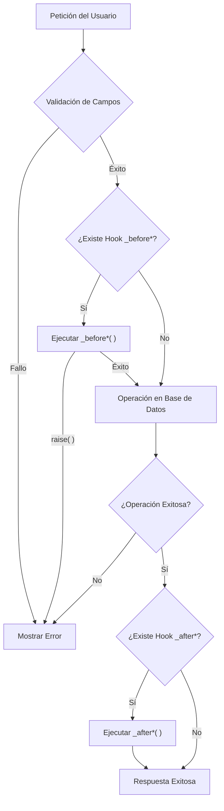

# Hooks y ciclo de vida en Ragnos

En Ragnos, los **hooks** permiten ejecutar lógica personalizada en distintos momentos del ciclo de vida de un dataset.
Son el mecanismo principal para **extender comportamiento** sin romper el modelo declarativo.

Los hooks se definen como métodos protegidos dentro del controlador que extiende `RDatasetController`.

!!! info "Concepto Clave"

    El controlador **no implementa el CRUD** manualmente. Ragnos se encarga de la operación de base de datos, y tú solo "te enganchas" (hook) en los puntos clave para inyectar tu lógica de negocio.

---

## Ciclo de Vida Visual

Entender el flujo de ejecución es crucial para saber dónde colocar tu lógica.



---

## Hooks disponibles

Ragnos expone los siguientes hooks, todos opcionales:

| Hook              | Momento de ejecución              |
| ----------------- | --------------------------------- |
| `_beforeInsert()` | Antes de insertar un registro     |
| `_afterInsert()`  | Después de insertar un registro   |
| `_beforeUpdate()` | Antes de actualizar un registro   |
| `_afterUpdate()`  | Después de actualizar un registro |
| `_beforeDelete()` | Antes de eliminar un registro     |
| `_afterDelete()`  | Después de eliminar un registro   |

---

## Herramientas y conceptos fundamentales

Antes de escribir funciones específicas, es importante conocer las herramientas que Ragnos proporciona dentro de los hooks para interactuar con los datos y el flujo de la aplicación.

### 1. Estructura básica

Los hooks de tipo `_before*` (Insert y Update) reciben por referencia el array `$data`, permitiendo modificar los valores antes de que lleguen a la base de datos. Si no necesitas modificar datos, en algunos casos puedes omitir el argumento o no usarlo.

```php
// Hook con manipulación de datos (por referencia)
protected function _beforeInsert(&$data)
{
    $data['creado_el'] = date('Y-m-d');
}
```

### 2. Acceso a valores: `newValue()` y `oldValue()`

Para facilitar la lógica de negocio, Ragnos proporciona funciones helper para inspeccionar el estado de los datos:

- **`newValue('campo')`**: Valor que se está intentando guardar (payload de la petición).
- **`oldValue('campo')`**: Valor original que ya existe en la base de datos (antes de la modificación).

| Helper       | Insert | Update | Delete |
| :----------- | :----: | :----: | :----: |
| `newValue()` |   ✅   |   ✅   |   ❌   |
| `oldValue()` |   ❌   |   ✅   |   ✅   |

### 3. Detección de cambios: `fieldHasChanged()`

Útil especialmente en actualizaciones para ejecutar acciones solo si un campo específico ha sido modificado.

```php
if (fieldHasChanged('status')) {
    // Enviar notificación de cambio de estatus
}
```

### 4. Interrupción segura: `raise()`

Si necesitas detener una operación debido a una regla de negocio, usa `raise()`. Esto detiene el proceso y muestra un mensaje de error al usuario, evitando que la operación CRUD continúe.

```php
if (oldValue('locked') === true) {
    raise('No se puede modificar un registro bloqueado.');
}
```

!!! tip "Nota de Diseño"

    `raise()` es preferible a `throw new Exception` para errores de validación lógica ("Soft errors") que el usuario debe corregir.

!!! note "Refactorización y Organización"

    Aunque Ragnos **no te obliga** a crear clases externas para las funciones de los hooks (puedes escribir la lógica directamente en el controlador), si las **reglas de negocio son suficientemente complejas**, es conveniente y recomendable refactorizarlas en **Modelos**, **Librerías** o **Servicios** dedicados. Esto ayuda a mantener el código organizado, reutilizable y más fácil de mantener.

---

## Hooks de Inserción

Estos hooks se ejecutan durante la creación de nuevos registros.

### `_beforeInsert(&$data)`

Se ejecuta **antes** del INSERT. Recibe `$data` por referencia.

**Usos comunes:**

- Inicializar valores automáticos (fechas, UUIDs).
- Normalizar datos (mayúsculas, formatos).
- Validaciones personalizadas del payload.

```php
protected function _beforeInsert(&$data)
{
    // Asignar fecha de creación manual
    $data['created_at'] = date('Y-m-d H:i:s');

    // Forzar mayúsculas en el RFC
    if (isset($data['rfc'])) {
        $data['rfc'] = strtoupper($data['rfc']);
    }
}
```

### `_afterInsert()`

Se ejecuta **después** de un INSERT exitoso.

**Usos comunes:**

- Logs de auditoría.
- Envío de notificaciones de bienvenida.

```php
protected function _afterInsert()
{
    log_message('info', 'Nuevo usuario registrado con ID ' . $this->insertID());
}
```

---

## Hooks de Actualización

Estos hooks gestionan la modificación de registros existentes. Es donde reside la mayor parte de la lógica de negocio compleja.

### `_beforeUpdate(&$data)`

Se ejecuta **antes** del UPDATE. Recibe `$data` con los campos a actualizar.

**Usos comunes:**

- Validaciones de transición de estados.
- Registrar metadatos de edición (`updated_by`).
- Protección de campos críticos.

```php
protected function _beforeUpdate(&$data)
{
    // Registrar quién modificó el registro
    $data['updated_by'] = session('user_id');

    // Validar regla de negocio: No reabrir tareas completadas
    if (oldValue('status') === 'completed' && newValue('status') === 'pending') {
        raise('No se puede reabrir una tarea completada.');
    }
}
```

### `_afterUpdate()`

Se ejecuta **después** de un UPDATE exitoso.

**Usos comunes:**

- Invalidar cache.
- Recalcular datos dependientes en otras tablas.

```php
protected function _afterUpdate()
{
    // Si cambió el límite de crédito, invalidar el cache de estados de cuenta
    if (fieldHasChanged('creditLimit')) {
        \Config\Services::cache()->delete('estadosdecuenta');
    }
}
```

---

## Hooks de Eliminación

Gestionan el borrado de información.

### `_beforeDelete()`

Se ejecuta **antes** del DELETE.

**Usos comunes:**

- Validar dependencias (integridad referencial manual).
- Evitar borrado de registros del sistema.

```php
protected function _beforeDelete()
{
    // Proteger al usuario Administrador (ID 1)
    if (oldValue('user_id') == 1) {
        raise('No se puede eliminar al usuario administrador principal.');
    }

    // Verificar relaciones manualmente
    if ($this->hasRelations()) {
        raise('No se puede eliminar el registro porque tiene datos asociados.');
    }
}
```

### `_afterDelete()`

Se ejecuta **después** del DELETE.

**Usos comunes:**

- Limpieza de archivos adjuntos (imágenes, documentos).
- Logs de actividad.

```php
protected function _afterDelete()
{
    log_message('info', 'Registro eliminado correctamente.');
}
```

---

## Caso de Estudio: Cifrado de Contraseñas

Este ejemplo real muestra cómo combinar hooks para gestionar contraseñas de usuarios de forma segura.

```php
// Al crear, SIEMPRE se cifra la contraseña
public function _beforeInsert(&$userData)
{
    $userData['usu_pword'] = md5(strtoupper($userData['usu_pword']));
}

// Al editar, SOLO se cifra si el usuario escribió una nueva contraseña
public function _beforeUpdate(&$userData)
{
    if (fieldHasChanged('usu_pword')) {
        $userData['usu_pword'] = md5(strtoupper($userData['usu_pword']));
    }
}
```

**Explicación:**

1. En `_beforeInsert`, la contraseña siempre viene en texto plano, así que se cifra incondicionalmente.
2. En `_beforeUpdate`, usamos `fieldHasChanged` para detectar si el usuario ingresó una nueva clave. Si no se verifica esto, se podría volver a cifrar el hash existente, corrompiendo la contraseña.

---

## Hooks de Interfaz (UI)

Ragnos permite intervenir también en la interfaz visual generada.

### `_customFormDataFooter()`

Inserta HTML o scripts al pie del formulario de edición.

```php
function _customFormDataFooter()
{
    $id = $this->request->getPost($this->getIdField());

    // Retornamos una vista parcial
    return view('Tienda/detalle_pedidos', ['orderId' => $id]);
}
```

---

## Buenas prácticas

!!! success "Recomendado"

    **Mantén los hooks pequeños:** La lógica compleja debe ir a Servicios o Librerías.

    **Documenta efectos secundarios:** Si un hook altera otra tabla, deja un comentario claro. - **Usa `raise()`** para errores de validación en lugar de excepciones duras.

!!! fail "A evitar"

    **No reemplaces el controlador:** Los hooks son para _extender_, no para reescribir el flujo CRUD.

    **Cuidado con el SQL manual:** Intenta usar los modelos siempre que sea posible.

---

## Filosofía

Los hooks en Ragnos permiten **extender sin romper**:

- **Desacoplamiento:** No acoplan lógica de negocio dura al mecanismo CRUD genérico.
- **Declarativo:** Mantienen el enfoque de configuración sobre programación.
- **Mantenibilidad:** Separan claramente la responsabilidad "Qué guardar" de "Qué hacer cuando se guarda".

!!! quote "Filosofía Ragnos"

    **En Ragnos, los hooks no controlan el flujo: reaccionan al dominio.**
