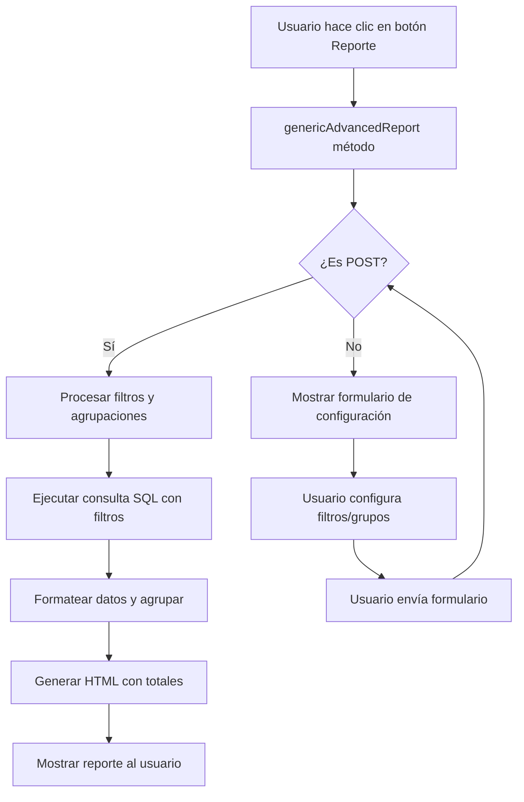

# 📊 Generador Automático de Reportes

## Introducción

El **Generador Automático de Reportes** (`RDatasetReportGenerator`) es una característica poderosa de Ragnos que permite crear reportes complejos y personalizados **sin escribir código adicional**. 

Esta funcionalidad está **integrada automáticamente** en todos los datasets basados en `RDatasetController`, lo que significa que cualquier catálogo que hayas creado ya tiene capacidades de reportería avanzada disponibles desde el primer momento.

## Acceso desde la Interfaz Gráfica

Cada dataset basado en `RDatasetController` incluye automáticamente un botón de **"Reporte Avanzado"** (icono de impresora 🖨️) en la barra de herramientas de la vista de tabla:

```php
// Ubicado en: app/ThirdParty/Ragnos/Views/rdatasetcontroller/table_view.php
<a href="<?= site_url($clase . '/genericAdvancedReport') ?>"
    class="toolbtn btn btn-outline-secondary btn-lg bg-white shadow-sm"
    title="<?= lang('Ragnos.Ragnos_advanced_report_tooltip') ?>">
    <i class="bi bi-printer"></i>
</a>
```

Al hacer clic en este botón, el usuario accede a una interfaz de configuración de reportes donde puede:

1. **Aplicar filtros** sobre diferentes campos
2. **Definir agrupaciones** multinivel
3. **Generar reportes** con totales y subtotales automáticos

## Características Principales

### 1. Generación Automática de Filtros

El generador analiza **automáticamente** todos los campos definidos en tu dataset mediante `addField()` y crea los filtros apropiados según el tipo de campo:

#### Tipos de Filtros Detectados Automáticamente

| Tipo de Campo | Tipo de Filtro Generado | Descripción |
|---------------|------------------------|-------------|
| `date` / `datetime` | **Rango de Fechas** | Permite filtrar desde/hasta una fecha específica |
| `money` / `numeric` / `decimal` | **Rango Numérico** | Filtro min/max para valores numéricos |
| `dropdown` / `enum` | **Selector de Opciones** | Lista desplegable con las opciones definidas |
| `switch` / `boolean` | **Selector Booleano** | Filtro Sí/No o Activo/Inactivo |
| **Campos con `addSearch()`** | **Búsqueda Contextual** | Permite buscar en el dataset relacionado |
| Texto (otros) | **Filtro de Texto** | Búsqueda por coincidencia de texto |

#### Ejemplo de Detección Automática

```php
// En tu dataset de Clientes
$this->addField('customerName', [
    'label' => 'Nombre del Cliente',
    'rules' => 'required'
]);
// → Se generará un filtro de TEXTO

$this->addField('creditLimit', [
    'label' => 'Límite de Crédito',
    'rules' => 'required|money'
]);
// → Se generará un filtro de RANGO NUMÉRICO (min/max)

$this->addField('status', [
    'label' => 'Estado',
    'type' => 'dropdown',
    'options' => [
        'active' => 'Activo',
        'inactive' => 'Inactivo',
        'suspended' => 'Suspendido'
    ]
]);
// → Se generará un filtro de SELECCIÓN con las opciones definidas

$this->addSearch('salesRepEmployeeNumber', 'Tienda\\Empleados');
// → Se generará un filtro de BÚSQUEDA que reutiliza el dataset de Empleados
```

### 2. Generación Automática de Agrupaciones

Los criterios de agrupación también se generan automáticamente basándose en la configuración de campos:

#### Tipos de Agrupación Detectados

| Tipo de Campo | Agrupaciones Generadas |
|---------------|------------------------|
| `date` / `datetime` | • **Por Mes** (Año-Mes)<br>• **Por Año** |
| **Campos con `addSearch()`** | • **Por Valor Exacto** del campo relacionado |
| `dropdown` / `enum` | • **Por Valor Exacto** de la opción seleccionada |

#### Ejemplo de Agrupaciones Automáticas

```php
// Campo de fecha en el dataset de Órdenes
$this->addField('orderDate', [
    'label' => 'Fecha de Orden',
    'type' => 'date',
    'rules' => 'required'
]);
// → Genera dos opciones de agrupación:
//   1. "Fecha de Orden (Por Mes)"
//   2. "Fecha de Orden (Por Año)"

// Campo relacionado en el dataset de Pagos
$this->addSearch('customerNumber', 'Tienda\\Clientes');
// → Genera agrupación:
//   "customerNumber (Valor exacto)" - agrupa por cliente
```

### 3. Agrupación Multinivel

El generador soporta **hasta 3 niveles de agrupación jerárquica**, permitiendo reportes complejos como:

- **Ventas por Año → Mes → Empleado**
- **Pagos por Cliente → Año → Método de Pago**
- **Productos por Línea → Año → Mes**

Cada nivel de agrupación genera automáticamente **subtotales** y el reporte incluye un **total general**.

### 4. Búsqueda Contextual en Filtros

Cuando un campo está vinculado a otro dataset mediante `addSearch()`, el filtro del reporte hereda toda la funcionalidad de búsqueda contextual:

**Ejemplo Práctico:**

En el dataset de **Pagos**, tienes:
```php
$this->addSearch('customerNumber', 'Tienda\\Clientes');
```

Y en el dataset de **Clientes**, definiste:
```php
$this->setTableFields([
    'customerName',
    'Contacto', // Campo calculado
    'salesRepEmployeeNumber' // Empleado a cargo
]);
```

**Resultado en el Generador de Reportes:**

Al filtrar pagos por cliente, el usuario puede buscar escribiendo:
- El nombre de la empresa
- El nombre del contacto
- El nombre del empleado a cargo

¡El sistema buscará automáticamente en todos los campos visibles del dataset de Clientes!

## Arquitectura y Funcionamiento

### Clase `RDatasetReportGenerator`

Esta clase es el motor detrás de la generación automática de reportes. Sus responsabilidades incluyen:

1. **Introspección de Campos** (`detectCapabilities()`)
   - Analiza todos los campos del dataset
   - Identifica tipos de filtros aplicables
   - Detecta criterios de agrupación viables
   - Ignora campos no aptos (claves primarias, campos únicos, archivos)

2. **Procesamiento de Solicitudes** (`processRequest()`)
   - Lee los filtros y agrupaciones enviados desde el formulario
   - Valida y normaliza los valores
   - Construye las condiciones de consulta

3. **Generación de Consultas SQL**
   - Aplica filtros simples (`WHERE campo = valor`)
   - Aplica rangos de fechas (`WHERE fecha >= inicio AND fecha <= fin`)
   - Aplica rangos numéricos (`WHERE campo >= min AND campo <= max`)
   - Maneja correctamente JOINs para campos relacionados

4. **Formateo y Agrupación** (`generateHTML()`)
   - Ejecuta la consulta con todos los filtros aplicados
   - Enriquece los datos con claves de agrupación formateadas
   - Ordena jerárquicamente por los niveles de agrupación
   - Delega el formateo de valores al modelo (moneda, fechas, relaciones)

5. **Generación de Reporte HTML**
   - Utiliza `RSimpleLevelReport` para generar HTML estructurado
   - Incluye totales y subtotales automáticos
   - Muestra descripción de filtros aplicados

### Flujo de Ejecución



## Uso Práctico: Ejemplo Completo

### Dataset de Órdenes

```php
namespace App\Controllers\Tienda;

use App\ThirdParty\Ragnos\Controllers\RDatasetController;

class Ordenes extends RDatasetController
{
    public function __construct()
    {
        parent::__construct();
        
        $this->checkLogin();
        $this->setTitle('Órdenes de Compra');
        
        $this->setTableName('orders');
        $this->setIdField('orderNumber');
        
        // Campo de fecha → generará filtro de rango + agrupación por mes/año
        $this->addField('orderDate', [
            'label' => 'Fecha de Orden',
            'type'  => 'date',
            'rules' => 'required'
        ]);
        
        // Campo relacionado → generará filtro de búsqueda + agrupación por cliente
        $this->addSearch('customerNumber', 'Tienda\\Clientes');
        
        // Campo enum → generará filtro de selección + agrupación por estado
        $this->addField('status', [
            'label'   => 'Estado',
            'type'    => 'dropdown',
            'options' => [
                'Shipped'   => 'Enviado',
                'Pending'   => 'Pendiente',
                'Cancelled' => 'Cancelado'
            ],
            'rules' => 'required'
        ]);
        
        // Campo calculado (monto total)
        $this->addField('Total', [
            'label' => 'Total',
            'query' => '(SELECT SUM(quantityOrdered * priceEach) 
                         FROM orderdetails 
                         WHERE orderdetails.orderNumber = orders.orderNumber)',
            'rules' => 'readonly|money'
        ]);
        
        $this->setTableFields([
            'orderNumber',
            'orderDate',
            'customerNumber',
            'status',
            'Total'
        ]);
    }
}
```

### Reportes Generados Automáticamente

Con esta configuración, el usuario puede generar reportes como:

**Ejemplo 1: Ventas por Cliente en un Rango de Fechas**
- **Filtro:** Fecha desde 2024-01-01 hasta 2024-12-31
- **Agrupación:** Por Cliente
- **Resultado:** Lista de clientes con el total vendido a cada uno en 2024

**Ejemplo 2: Órdenes Canceladas por Mes**
- **Filtro:** Estado = "Cancelado"
- **Agrupación Nivel 1:** Por Mes
- **Resultado:** Total de órdenes canceladas agrupadas por mes con subtotales

**Ejemplo 3: Análisis Jerárquico Anual**
- **Agrupación Nivel 1:** Por Año
- **Agrupación Nivel 2:** Por Mes  
- **Agrupación Nivel 3:** Por Estado
- **Resultado:** Reporte jerárquico: Año → Mes → Estado con todos sus subtotales

## Ventajas del Sistema

### 1. **Cero Configuración Adicional**
No necesitas escribir controladores especiales, vistas o queries para reportes. Todo se genera automáticamente desde la definición del dataset.

### 2. **Reutilización de Lógica**
Los filtros y agrupaciones reutilizan:
- Las validaciones definidas en `addField()`
- Las relaciones definidas con `addSearch()`
- El formateo definido en el modelo

### 3. **Consistencia de Interfaz**
Todos los datasets tienen exactamente la misma interfaz de reportes, reduciendo la curva de aprendizaje para los usuarios.

### 4. **Flexibilidad Total**
Los usuarios finales pueden combinar cualquier filtro con cualquier agrupación, generando reportes ad-hoc según sus necesidades sin requerir desarrollo.

### 5. **Escalabilidad**
A medida que agregas más campos a tu dataset, automáticamente se amplían las opciones de filtros y agrupaciones disponibles.

## Limitaciones y Consideraciones

### Campos Excluidos Automáticamente

El sistema **ignora** automáticamente ciertos tipos de campos para filtros y agrupaciones:

- **Claves primarias**: No suelen ser útiles para filtros generales
- **Campos con `is_unique`**: Pensados para identificadores únicos
- **Archivos e imágenes** (`fileupload`, `imageupload`)
- **Contraseñas** (`password`)

### Campos Calculados y Agrupaciones

Los campos con `query` (calculados) pueden aparecer en el reporte, pero **no se pueden usar como criterio de agrupación** ya que son expresiones SQL derivadas.

### Performance en Grandes Volúmenes

Para datasets con millones de registros, considera:
- Añadir índices en campos frecuentemente filtrados
- Limitar las opciones de agrupación si son muy costosas
- Implementar paginación o límites en la consulta si es necesario

## Personalización Avanzada

Aunque el generador es automático, puedes influir en su comportamiento:

### Controlar qué Campos son Filtrables

Al definir campos como `hidden` o con reglas específicas, puedes controlar su aparición en filtros:

```php
// Este campo NO aparecerá en filtros (es hidden y calculado)
$this->addField('internalCode', [
    'label' => 'Código Interno',
    'type'  => 'hidden',
    'query' => 'MD5(customerNumber)'
]);
```

### Métodos Programáticos

También puedes usar el generador programáticamente desde código:

```php
public function reportePersonalizado()
{
    $generator = new RDatasetReportGenerator($this);
    
    // Agregar filtros manualmente
    $generator->addDateRangeFilter('orderDate', '2024-01-01', '2024-12-31');
    $generator->addFilter('status', 'Shipped');
    
    // Configurar agrupación
    $generator->setGrouping('customerNumber', 'raw', 'Cliente');
    $generator->setGrouping('orderDate', 'date_month', 'Mes');
    
    // Generar HTML
    $html = $generator->generateHTML();
    
    return view('mi_plantilla_reporte', ['contenido' => $html]);
}
```

## Integración con el Ecosistema Ragnos

### Relación con `addSearch()`

Como se mencionó en la [guía de Datasets](../datasets/datasets.md#relaciones-entre-datasets-addsearch), los campos definidos con `addSearch()` no solo crean selectores en formularios, sino que también:

1. **En Filtros de Reportes:** Permiten búsqueda contextual avanzada
2. **En Agrupaciones:** Se convierten automáticamente en criterios de agrupación

Esta sinergia hace que definir relaciones sea doblemente poderoso.

### Relación con `setTableFields()`

Los campos incluidos en `setTableFields()` son los que aparecerán en el reporte generado. Esto te da control sobre qué columnas se muestran sin afectar la disponibilidad de filtros y agrupaciones.

## Conclusión

El **Generador Automático de Reportes** es una de las características más potentes de Ragnos, transformando cada dataset simple en una herramienta de análisis avanzado sin esfuerzo adicional de desarrollo.

Al aprovechar toda la metadata declarativa que defines en tu dataset (`addField`, `addSearch`, `setTableFields`), el sistema construye automáticamente una interfaz completa de reportería con:

- ✅ Filtros inteligentes según tipo de campo
- ✅ Agrupaciones jerárquicas multinivel
- ✅ Búsqueda contextual en relaciones
- ✅ Totales y subtotales automáticos
- ✅ Interfaz consistente en todos los módulos

**Resultado:** Reportes empresariales de calidad profesional, disponibles en minutos, no en semanas.
