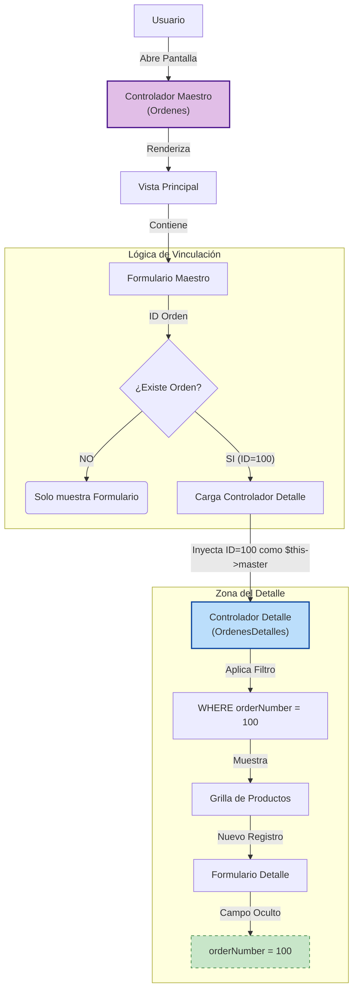

# 📑 Relación Maestro-Detalle en Ragnos

Esta guía explica cómo crear una pantalla donde tienes un registro principal (como una **Orden de compra**) y una lista de elementos relacionados (los **Detalles** o productos de esa orden).

## Arquitectura de la Relación



La idea básica es tener dos controladores:

1. **El Maestro (Ordenes):** Controla la información general (fecha, cliente, total).
2. **El Detalle (OrdenesDetalles):** Controla la lista de productos dentro de esa orden.

---

## 1. Configurando el Maestro (Controlador `Ordenes`)

Este es el "padre" de la relación. Aquí definimos la cabecera de la factura.

- **Configuración básica:** Le decimos a Ragnos que use la tabla `orders` y que la clave principal es `orderNumber`.
- **Campos:** Definimos los campos normales como fecha (`orderDate`), estado (`status`) y cliente (`customerNumber`).
- **Campo Total (Calculado):** Para mostrar el total de la orden sin guardarlo manualmente, usamos una pequeña consulta SQL dentro de la configuración del campo. Esta consulta suma `cantidad * precio` de la tabla de detalles.
- **Activar el modo detalle:**
  Hay una línea clave que debes agregar en tu controlador maestro para avisar que tendrá "hijos". Puedes pasar un solo controlador o un arreglo con múltiples controladores para crear pestañas automáticamente:

  **Para un solo detalle:**

  ```php
  $this->setDetailsController('Tienda\Ordenesdetalles');
  ```

  Esto le dice a Ragnos que el controlador `Ordenesdetalles` manejará los detalles relacionados con cada orden.

  **Para múltiples detalles (Pestañas):**
  Si tu registro principal tiene varios tipos de detalles (por ejemplo, productos y un historial), puedes pasar un arreglo de controladores. Ragnos generará automáticamente una interfaz con pestañas (nav-tabs) para mostrar cada detalle por separado:

  ```php
  $this->setDetailsController([
      'Tienda\Ordenesdetalles',
      'Tienda\Ordeneshistorial'
  ]);
  ```

  La relación se basa en que el campo `orderNumber` en estos controladores es el mismo, y este es la llave primaria en el maestro.

## 2. Configurando el Detalle (Controlador `Ordenesdetalles`)

Este es el "hijo". Controla cada línea de producto.

- **El truco del campo oculto:**
  Necesitamos que cada producto sepa a qué orden pertenece. Para eso, en el campo `orderNumber` del detalle hacemos dos cosas:
  1. Lo ponemos como `hidden` (oculto) para que el usuario no lo toque.
  2. Le asignamos el valor por defecto `$this->master`.
     _¿Qué hace esto?_ Cuando creas un detalle desde la orden #100, Ragnos automáticamente rellena este campo con el número 100.
- **Filtrar los datos:**
  No queremos ver _todos_ los productos de _todas_ las órdenes. En el método `_filters()`, agregamos una regla para que solo se carguen los productos que coincidan con el ID del maestro actual (`$this->master`).

  ```php
  function _filters()
  {
      $this->modelo->builder()->where('orderNumber', $this->master);
  }
  ```

  En este fragmento, `$this->modelo->builder()` permite interactuar directamente con la consulta SQL que generará la grilla. La variable `$this->master` es inyectada automáticamente por el framework cuando detecta que este controlador se está ejecutando como "hijo", y contiene el ID del registro que se está visualizando en el maestro (en este caso, el número de orden).

- **Actualizar cambios:**
  Usamos funciones especiales (llamadas _hooks_) como `_afterInsert` o `_afterUpdate` para limpiar la memoria caché. Esto asegura que si agregas un producto, el total de la orden principal se recalcule correctamente.
  👉 **[Ver Guía de Hooks](../avanzado/hooks.md)**

## Hooks de javascript personalizados (Opcional)

En el archivo custom.js se ha agregado la siguiente función:

```javascript
// con cada cambio en la tabla de detalles de ordenes
// recalcula el total de la orden
function _OrdenesdetallesOnChange(tabla) {
  let orden = $("input[name='orderNumber']").val();
  getObject("tienda/ordenes/calculatotal", { orden: orden }, function (data) {
    $('input[name="total"]').val(data.total);
  });
}
```

Esta función se ejecuta cada vez que hay un cambio en la tabla de detalles de órdenes. Lo que hace es:

1. Obtiene el número de orden actual desde el campo oculto.
2. Llama a un endpoint (`tienda/ordenes/calculatotal`) para recalcular el total de la orden.
3. Actualiza el campo `total` en la pantalla con el nuevo valor.

de este modo, el total siempre estará actualizado, cada que se agregue, modifique o elimine un producto en la orden.

Esta función se enlaza automáticamente gracias a la convención de nombres: `_NombreDelControladorOnChange`.

## Resumen del flujo de trabajo

1. **Abres una Orden:** Ves los datos generales (Maestro).
2. **El sistema verifica:** ¿Esta orden ya existe?
   - **Sí:** Carga automáticamente la tabla de productos relacionados al final de la pantalla.
   - **No:** Oculta la sección de productos hasta que guardes la orden por primera vez.
3. **Agregas un producto:** Al crear una línea en la tabla de detalles, el sistema le pega invisiblemente el número de la orden padre.
4. **Guardas:** Al guardar el detalle, el sistema actualiza los totales y todo se mantiene sincronizado.

¡Y listo! Con estos pasos logras que dos tablas funcionen como una sola pantalla integrada.
