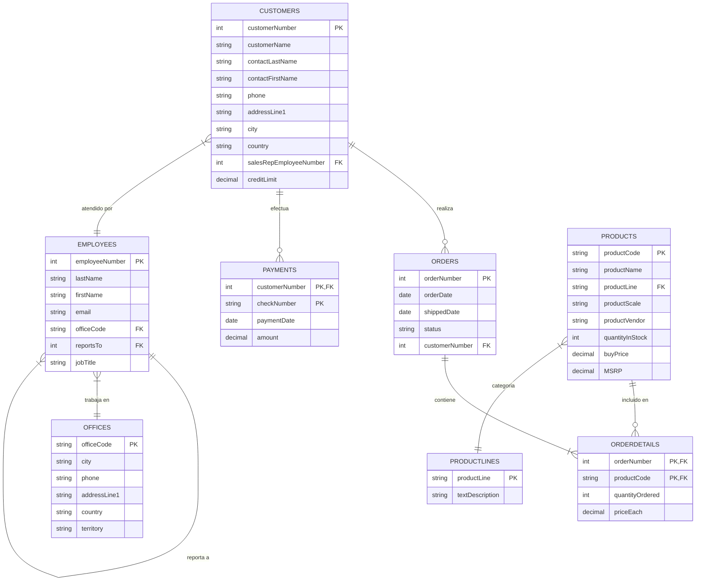

# Base de Datos Demo (Classicmodels)

Ragnos incluye la base de datos de ejemplo **Classicmodels**, una implementación estándar conocida en el mundo del desarrollo para probar funcionalidades de bases de datos relacionales.

Esta base de datos modela un negocio de **venta de modelos a escala de coches clásicos**. Contiene información típica de un negocio: clientes, productos, pedidos, pagos, empleados y oficinas.

## 📊 Estructura de la Base de Datos

La base de datos consta de 8 tablas relacionadas entre sí. A continuación se presenta un diagrama Entidad-Relación (ER) que ilustra la estructura:

## 📝 Descripción de las Tablas

A continuación se detalla el propósito de cada tabla:

### 1. Customers (Clientes)

Almacena la información de los clientes de la empresa.

- **Datos clave:** Nombre, contacto, dirección, teléfono, límite de crédito.
- **Relaciones:** Se vincula con `Employees` (representante de ventas asignado), `Orders` (pedidos realizados) y `Payments` (pagos efectuados).

### 2. Products (Productos)

Catálogo de modelos a escala de coches, motos y otros vehículos clásicos.

- **Datos clave:** Código, nombre, escala, proveedor, descripción, stock, precio de compra y precio de venta sugerido (MSRP).
- **Relaciones:** Pertenece a una `ProductLine` y aparece en `OrderDetails`.

### 3. ProductLines (Líneas de Productos)

Categorías en las que se clasifican los productos (ej. "Classic Cars", "Motorcycles").

- **Datos clave:** Nombre de la línea, descripción.

### 4. Orders (Pedidos)

Cabecera de los pedidos realizados por los clientes.

- **Datos clave:** Fechas (pedido, requerido, enviado), estado (Shipped, Cancelled, etc.), comentarios.
- **Relaciones:** Vinculado al `Customer` que hizo el pedido.

### 5. OrderDetails (Detalles de Pedido)

Líneas individuales de cada pedido, especificando qué productos se compraron.

- **Datos clave:** Cantidad ordenada, precio unitario real.
- **Relaciones:** Vincula `Orders` con `Products` (relación muchos a muchos).

### 6. Payments (Pagos)

Registro de pagos realizados por los clientes.

- **Datos clave:** Número de cheque, fecha de pago, monto.
- **Relaciones:** Vinculado a `Customers`.

### 7. Employees (Empleados)

Información del personal de la empresa.

- **Datos clave:** Nombre, email, puesto de trabajo.
- **Relaciones:**
  - Pertenece a una `Office`.
  - Se reporta a otro empleado (estructura jerárquica).
  - Es representante de ventas de `Customers`.

### 8. Offices (Oficinas)

Ubicaciones físicas de las oficinas de ventas.

- **Datos clave:** Ciudad, teléfono, dirección, país, territorio.

---

## 🔐 Acceso a la Demo

Si has instalado el proyecto y cargado estos datos de ejemplo, o estás accediendo a nuestra demo en línea, puedes utilizar las siguientes credenciales para acceder al panel administrativo:

!!! info "Credenciales de Acceso"

    *   **URL Demo:** [https://ragnos.yupii.org/](https://ragnos.yupii.org/)
    *   **Usuario:** `admin`
    *   **Contraseña:** `admin`

Una vez dentro, podrás explorar los módulos creados sobre esta estructura de base de datos para ver Ragnos en acción (Datasets maestro-detalle, reportes, gráficos, etc.).
